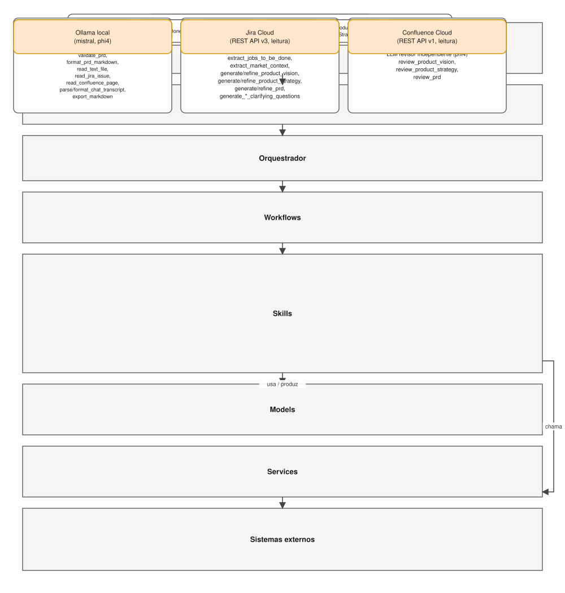
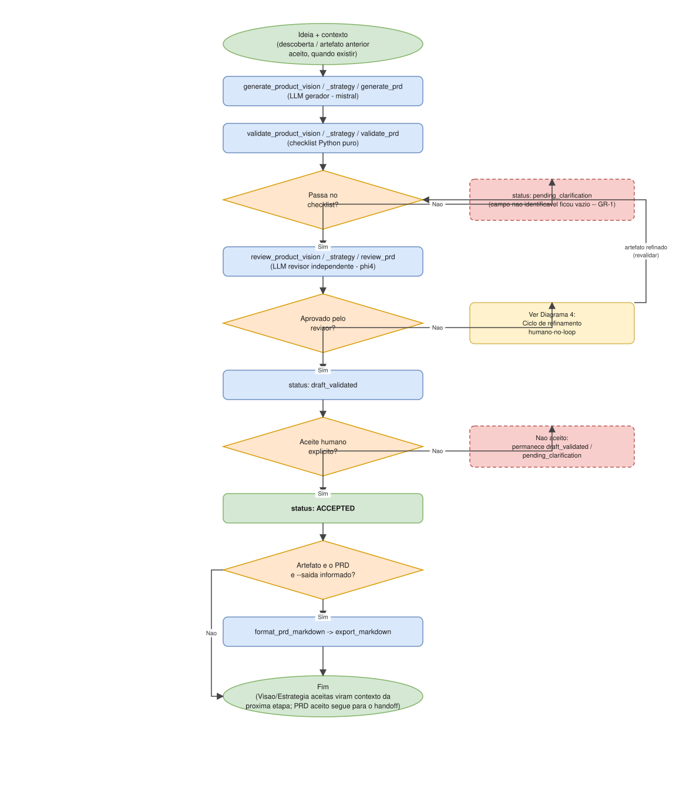
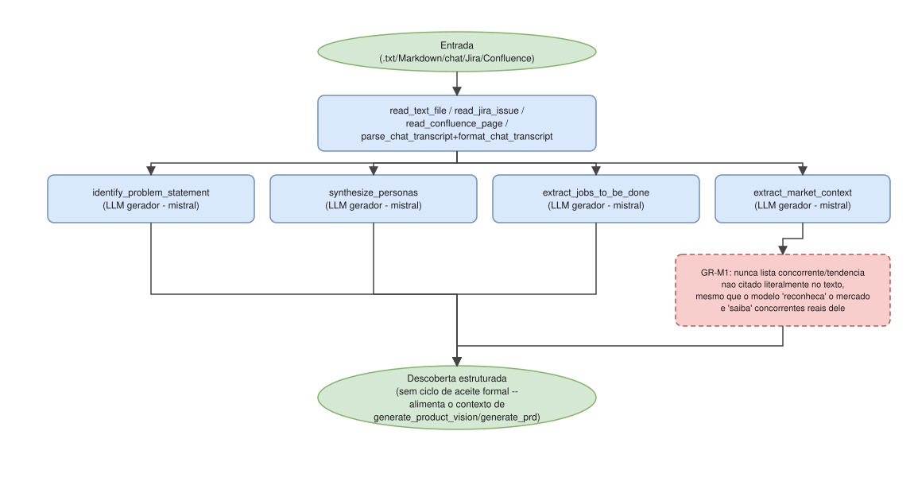
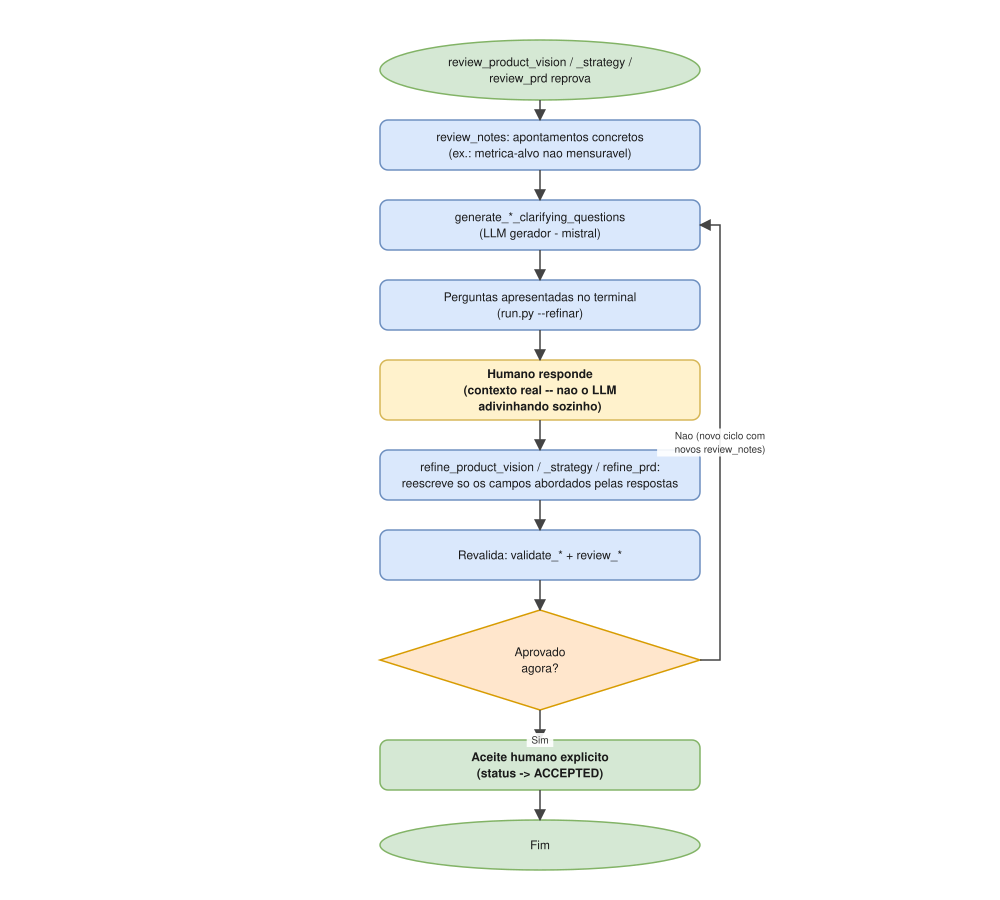
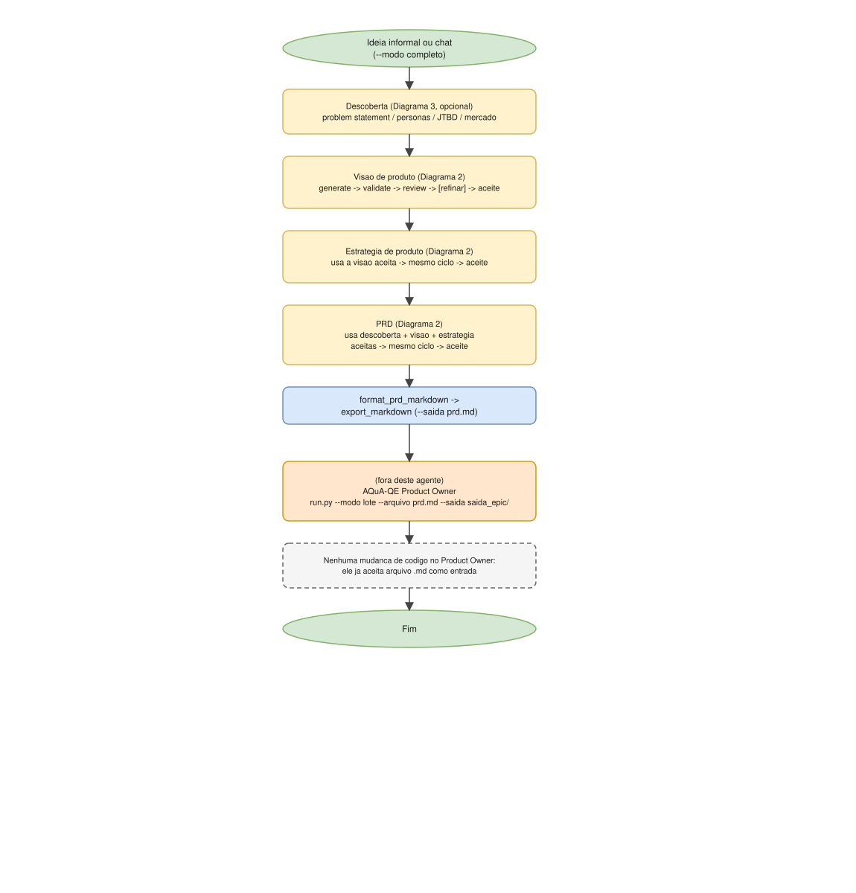

# Diagramas de arquitetura

Representação visual da arquitetura e dos fluxos do agente, complementando a documentação em prosa de `../agent/system_design.md`, `../agent/agent_design.md`, `../agent/skills.md` e `../../WHITEPAPER.md`.

- **Fonte editável**: [`architecture.drawio`](architecture.drawio) — arquivo único, 5 páginas, abra em [app.diagrams.net](https://app.diagrams.net) ou na extensão "Draw.io Integration" do VS Code.
- **Espelho estático**: `svg/*.svg` — mesmo conteúdo de cada página, visível diretamente aqui no GitHub/VS Code, sem precisar abrir o draw.io.

## 1 — Arquitetura em camadas

Da entrada (`.txt`/Markdown/chat/Jira/Confluence) até o Ollama local (e, para leitura, Jira/Confluence Cloud), passando por CLI, orquestrador, workflows, skills, models e services. Detalhe textual em `../agent/system_design.md`.

## 2 — Fluxo por artefato (Visão, Estratégia ou PRD)

Os três artefatos com ciclo de aceite formal (Visão, Estratégia, PRD) seguem exatamente o mesmo pipeline: `Generate → Validate → Review → [Refine] → Approve`, com os dois pontos de checagem (checklist automático e revisor independente) antes de qualquer aceite humano. Só o PRD, ao final, é formatado e exportado — Visão e Estratégia aceitas viram *contexto* para a etapa seguinte. Detalhe textual em `../agent/system_design.md` e `../agent/acceptance_patterns.md`.

Caso especial só para PRD (`--prd-existente`): a etapa `Generate` é substituída por `parse_prd_markdown` — carrega um PRD `.md` já pronto como `PRDDraft`, preservando a redação original campo a campo, e entra direto em `Validate`. Sem diagrama próprio; é o mesmo pipeline com a primeira etapa trocada.

Depois de `Approve`, o artefato aceito (PRD, Visão ou Estratégia — não só o PRD) pode opcionalmente ser publicado como página nova (`create_confluence_page`, `--publicar-confluence`) ou usado para atualizar uma página já existente (`update_confluence_page`, `--atualizar-confluence`, mutuamente exclusivo) no Confluence, sob uma segunda confirmação humana explícita, distinta do aceite — também sem diagrama próprio.

## 3 — Fluxo de descoberta

As quatro skills de descoberta rodam em paralelo sobre o mesmo texto de entrada, sem ciclo de aceite formal (são insumos estruturados, não artefatos "aceitos" isoladamente). `extract_market_context` é destacada à parte pelo guardrail GR-M1 — o mais crítico deste agente: nunca lista concorrente/tendência não citado literalmente no texto, mesmo que o modelo "reconheça" o mercado descrito.

## 4 — Ciclo de refinamento humano-no-loop

Herdado do AQuA-QE Product Owner: quando a revisão reprova, o agente gera perguntas objetivas para um humano responder — não tenta se autocorrigir sozinho. Aplica-se, com os mesmos passos, à Visão, à Estratégia e ao PRD. Ver seção 6 do `../../WHITEPAPER.md`.

## 5 — Pipeline completo e handoff para o AQuA-QE Product Owner

O caminho de `--modo completo`: descoberta (opcional) → visão → estratégia → PRD, cada etapa usando o artefato aceito anterior como contexto, terminando em `format_prd_markdown`/`export_markdown`. A ponte para o AQuA-QE Product Owner é só esse arquivo `prd.md` — nenhuma chamada direta entre os dois agentes, nenhuma mudança de código do lado do Product Owner. Ver seção 7 do `../../WHITEPAPER.md`.
